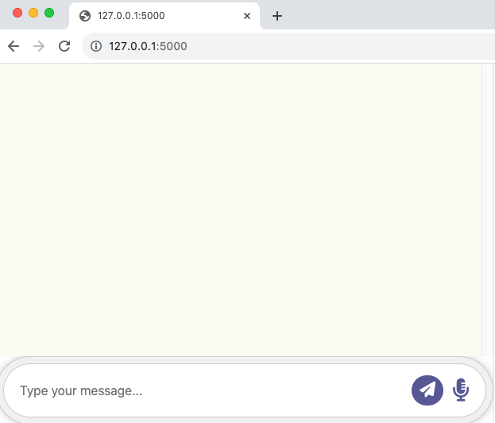
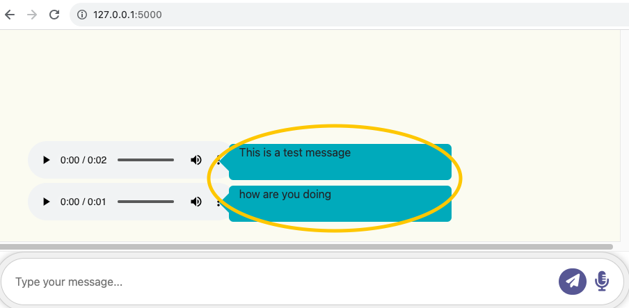

Project Specification: 
# Multi-Modal Chatbot Application: Voice-Bot

## Overview
This project aims to develop a multi-modal chatbot application that enables users to engage in conversations with the chatbot using both speech and text-based inputs. The chatbot will utilize speech recognition to convert user speech into text and employ text-to-speech technology to respond to users audibly. The chatbot is built using Python and Flask for the backend, and HTML, CSS, and JavaScript for the frontend.

## Features

- **Text-to-Speech:** Convert text messages to speech/audio messages.
- **Speech-to-Text:** Convert audio messages to text.
- **Chat History:** Display chat history with audio and text messages.

## Technologies Used

- Python
- Flask
- HTML
- CSS
- JavaScript

## Installation

To run the project locally, follow these steps:
1.	Clone the repository:

    ``` git clone https://github.com/sheetalvarsh/VoiceBot.git ```

2.	Change into the project directory:

    ``` cd VoiceBot ```

3.	Install the required packages

    ``` pip install -r requirements.txt ```

## Using the Application

### Text-to-Speech

1. Launch the application by running the following command:

    `python app.py`

2. Open your web browser and go to http://127.0.0.1:5000/.



3. In the input field labeled "Type your message," enter the text you want to convert to speech.


4. Click the "Send" button (paper plane icon) or press ENTER to generate the audio message.
5. Listen to the audio message using the playback controls.
6. The inputted message will also be displayed in the bubble.



### Speech-to-Text

1. Follow the steps above to launch the application.
2. Click the microphone icon to start recording your speech message.


3. Speak clearly into your microphone.
4. Click the "Stop" button (square icon) to stop recording.


5. The application will transcribe your speech into text and display it on the page.
6. If the speech is not clear, an error message will be displayed.


## Project Structure
*   **app.py**: Flask application file containing server-side logic.
*   **static**: Directory for static files (CSS, JavaScript, audio files).
*   **templates**: HTML templates for rendering web pages.
*   **requirements.txt**: List of Python packages required for the project.

## Contributors
Sheetal Varshney

## Troubleshooting
*	If you encounter any issues, please check the error messages displayed in the web interface.
*	Ensure that your microphone is properly connected and configured if you are using the voice recording feature.

## Issues and Limitations
*	Currently, the chat history is limited to the last 5 audio messages.
*	Speech recognition may not be accurate in noisy environments.

## Developer’s Documentation
For more technical details, API documentation, and advanced configurations, please refer to the [Developer's Documentation](./docs/developers_documentation.md)

## License
This project is licensed under [MIT LICENSE](./LICENSE)
