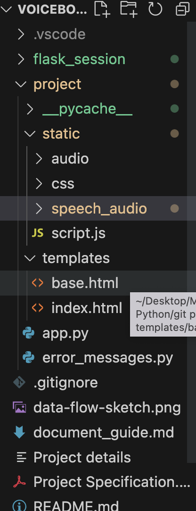

# Developer's Documentation/Guide

## Overview

This developer's documentation provides insights into the implementation details, deployment considerations, user interactions, known issues, and potential future work for the Multimodal Chatbot project.

## Implementation Status

The current implementation includes the following features:
* Text-to-Speech: Convert text messages to speech/audio messages.
* Speech-to-Text: Convert audio messages to text.
* Chat History: Display chat history with audio and text messages.

## Install/Deployment

Assuming the developer has already read the user's guide and has the project installed, the following points need attention:

*	Dependencies: Ensure all required packages are installed by running 
        ``` pip install - r requirements.txt ```
*	Start the Flask Application: Run the Flask application using python app.py.
*	Browser Compatibility: Verify that the application works well with different browsers.

## User Interaction and Code Flow

### User Interaction Flow

1.	Text-to-Speech:
    * User enters a text message and clicks the "send" button.
    * The message is converted to speech using gTTS.
    * The audio message is displayed with playback controls.

2.	Speech-to-Text:
    * User clicks the microphone button to start recording.
    * The recorded audio is sent to the server for recognition.
    * The recognized text is displayed alongside the audio message.

### Folder Structure 



### Code Flow

1. **Text-to-Speech**

    ***app.py***: Flask application file containing server-side logic.

    ***Routes***:
    - “/”: Renders the main chat interface.
    - “/text-to-speech”: Handles text-to-speech functionality.

    ***Functions***:
        text_to_speech: Converts text to speech and manages chat history.

    ***HTML Templates*** (in the templates folder):
    * index.html: Main chat interface.
        - Displays a-udio messages and recognized text.
        - Allows users to input text messages and interact with the chatbot.

    ***JavaScript*** (in script.js):
    * textToSpeech Function:
        - Sends a POST request for text-to-speech.
        - Dynamically updates the HTML to display audio messages and recognized text.

2.  **Speech-to-Text**

    ***app.py***: Flask application file containing server-side logic.

    ***Routes***:
       -  "/speech-to-text": Handles speech-to-text functionality.

    ***JavaScript*** (in script.js):
    * startRecording Function:
        - Activated when the user clicks the microphone button to start recording.
        - Initiates audio recording using the Web Speech API.

    * stopRecording Function:
        - Activated when the user clicks the stop button to end recording.
        - Sends the recorded audio data to the server for speech-to-text conversion.

    * handleSpeechToTextResponse Function:
        - Handles the server's response after speech-to-text conversion.
        - Updates the HTML to display the recognized text alongside the audio message.

**Event Listeners** :
- Start Recording Button: Calls startRecording Function.
- Stop Recording Button: Calls stopRecording Function.

**Server-Side Processing** (Within /speech-to-text Route in app.py):
- Receives the recorded audio data.
- Calls the speech_to_text Function from speech_recognition.py.
- Returns the recognized text to the client.

## Known Issues

### Minor Issues
* Few style issues in text-to-speech messages.
* Need to work on Stacking of converted messages.

### Major Issues
* The application may not work well with noisy audio input.
* Storing of messages 

### Future Work
* Implement a more robust speech recognition mechanism.
* Enhance the user interface with additional features.
* Explore options for real-time communication.

## Ongoing Deployment/Development
* Unit Tests: Include unit tests to ensure the reliability of core functionalities.
* Documentation Updates: Keep the documentation up-to-date with any changes.
* Code Refactoring: Regularly refactor the code for better maintainability.
* Compatibility Testing: Test the application with various browsers and environments.

## Note:-
 This documentation serves as a guide for developers taking over the project, providing insights into the current state, potential improvements, and considerations for ongoing deployment and development.

